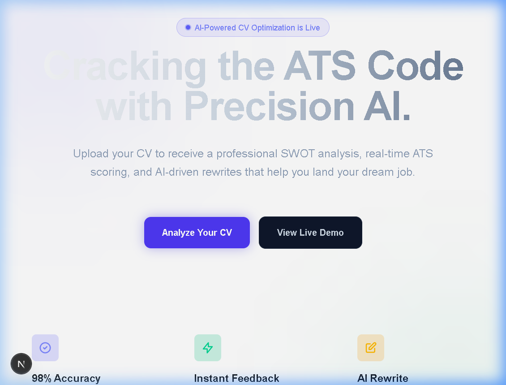
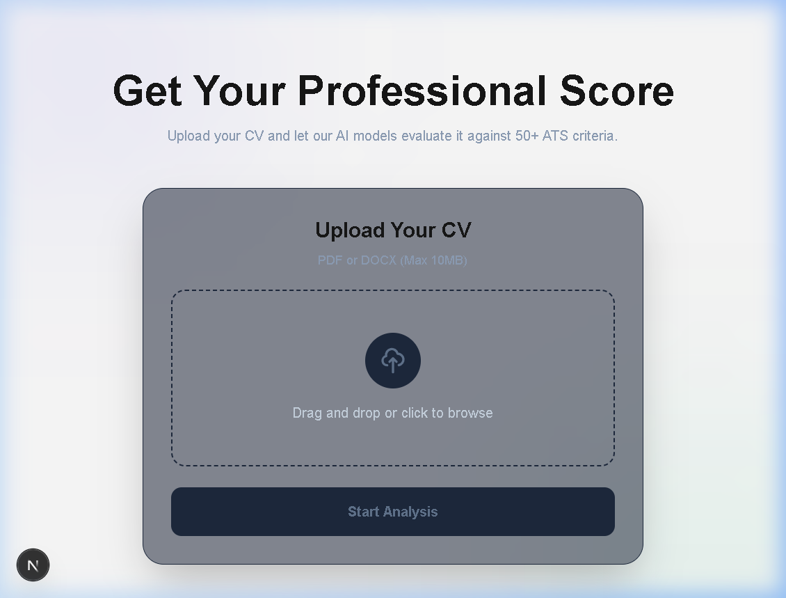

# CV Analyzer — Precision AI-Powered Career Optimization 🚀


**CV Analyzer** is a high-performance, AI-driven platform designed to help job seekers crack the ATS (Applicant Tracking System) code. Using a hybrid architecture of Next.js and FastAPI, it leverages GPT-4o and Claude 3 to provide instant ATS scoring, detailed SWOT analysis, and context-aware professional rewrites.

---

## ✨ Key Features

- 🧠 **Multi-Step AI Analysis**: Deep extraction and analysis using GPT-4o to minimize hallucinations.
- 📊 **Dynamic ATS Scoring**: Real-time feedback on keywords, formatting, and relevance.
- 🛡️ **SWOT Analysis**: Clearly identified Strengths, Weaknesses, Opportunities, and Threats.
- 🎯 **Job-Specific Matching**: Compare your CV against any job description using semantic embeddings.
- ✍️ **AI-Powered Rewrites**: Interactive "Accept/Reject" workflow to improve specific CV sections with Claude 3.
- 🌙 **Premium UI/UX**: Dark-themed, high-performance interface with smooth animations and glassmorphism.

---

## 📸 Screenshots

| Landing Page | Analysis Dashboard |
| :---: | :---: |
|  |  |

---

## 🛠️ Tech Stack

- **Frontend**: Next.js 14 (App Router), TypeScript, Tailwind CSS, Shadcn/UI.
- **Backend**: FastAPI (Python), Celery, Redis.
- **AI Layers**: OpenAI GPT-4o (Extraction/Scoring), Anthropic Claude 3 (Rewriting), OpenAI Embeddings.
- **Processing**: PyMuPDF & python-docx for high-accuracy document parsing.

---

## 🚀 Quick Start

### Prerequisites
- Node.js 18+
- Python 3.11+
- Redis Server

### Setup
1. **Clone the repository**:
   ```bash
   git clone https://github.com/[username]/cv-analyzer.git
   cd cv-analyzer
   ```

2. **Backend Setup**:
   ```bash
   cd backend
   pip install -r requirements.txt
   cp .env.example .env # Add your API keys
   uvicorn src.api.main:app --reload
   ```

3. **Frontend Setup**:
   ```bash
   cd frontend
   npm install
   npm run dev
   ```

---

## 📂 Project Structure

```text
├── backend/                # FastAPI Application
│   ├── src/
│   │   ├── api/            # API Endpoints & Routing
│   │   ├── services/       # AI & Processing Logic
│   │   ├── workers/        # Celery Tasks
│   │   └── models/         # Pydantic Schemas
├── frontend/               # Next.js Application
│   ├── src/
│   │   ├── app/            # App Router & Layouts
│   │   ├── components/     # UI Components
│   │   └── services/       # API Integration
├── specs/                  # Technical Specifications & Documentation
└── assets/                 # Project images & screenshots
```

---

## 📄 License
Distributed under the MIT License. See `LICENSE` for more information.

---

Built with ❤️ by [Your Name]
